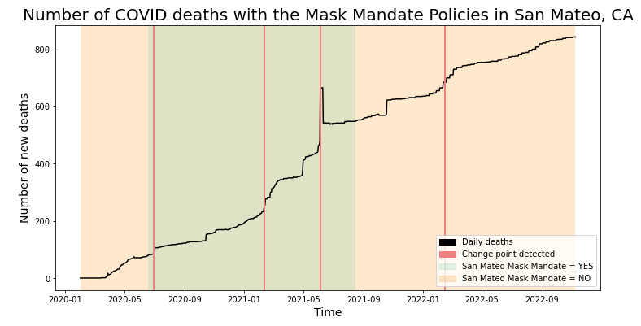

[](https://github.com/nayantaramohan/data512-project-repo/blob/main/LICENSE)

# DATA 512: Human Centered Data Science (Au 2022)

## Social and Economic Impacts of COVID-19 on San Mateo County, CA

## Goal
The goal of this assignment is to construct, analyze, and visualize covid 19 confirmed cases data of the assigned county during the given time period to answer the below research questions whose analysis have a social and economic impact on the people of San Mateo County.  
1.	How did masking policies change the progression of confirmed COVID-19 cases from February 1, 2020, through October 1, 2021?
2.	What other trends can the masking mandate by San Mateo County reveal about the pandemic?
3.	With every stage of vaccines administered, is there a decrease in the number of deaths caused by COVID?
4.	How was the housing rate affected in San Mateo County due to the pandemic?
5.	How was the unemployment rate affected in San Mateo County due to the pandemic?

## Motivation
We have been reading about covid cases and death numbers in various news and social media platforms, but we haven’t dived deep into the granular level of understanding of how this has affected the lives of people. It would be incorrect to generalize social implications at a higher abstraction as that wouldn’t be fair. By doing this analysis at a county level we can understand the social and economic impact of these quantitative numbers. This is useful to understand the trend of the covid cases and deaths based on other correlated factors. E.g., the masking mandates and vaccination administered status should ideally correlate with the number of confirmed covid cases and deaths. It is practically needed to conduct this analysis to educate the masses and crowd to continue masking mandates and further encourage them to get boosters as well. Apart from that, we learn some interesting patterns of covid cases and their relation to the unemployment rate, vaccines being administered, and median prices of houses. These interesting relationships can further help in understanding on what level the lives of people in San Mateo County, CA are affected. This analysis is important for the people of San Mateo County and the government officials to help in making human-centered social and economic reforms. The insights gained in the form of data and visualizations are powerful to draw the attention of the lawmakers. 

## Repository tree
```
├── input_data
│   ├── RAW_us_confirmed_cases.csv
│   ├── RAW_us_deaths.csv
│   ├── cdc_masking_mandates_county.csv.zip 
│   ├── housing_price.csv
│   ├── mask-use-by-county.csv 
│   └── unemployment_sanmat.csv
├── output_viz
│   ├── img1_common_analysis.png
│   ├── img2_covid_deaths_masking.png
│   ├── img3_covid_deaths_vaccines.png
│   ├── img4_housing_rate.png
│   └── img5_unemployment_rate.png
├── LICENSE
├── README.md
├── data512-course-project-report.pdf
└── project-analysis-nmohan.ipynb

```
#### Description
- **LICENSE** : a file that contains an MIT LICENSE for nayantaramohan/data512-project-repo.
- **project-analysis-nmohan.ipynb** : The Jupyter notebook that consists of all the code with documentation of the preprocessing, data cleaning and data visualization done to achieve the stated goal.  
- **data512-course-project-report.pdf** : This report consists of the documentation of this course project which is inclusive of an introduction, background, methodology, findings, discussions, limitations, conclusions, references and data sources used. 

## Input Data & Sources
1. **RAW_us_confirmed_cases.csv**: The RAW_us_confirmed_cases.csv file from the Kaggle repository of [John Hopkins University COVID-19 data](https://www.kaggle.com/datasets/antgoldbloom/covid19-data-from-john-hopkins-university).     
Description: Total number of daily confirmed covid cases across various counties in the United States.  

2. **cdc_masking_mandates_county.csv**: The CDC dataset of [masking mandates by county](https://data.cdc.gov/Policy-Surveillance/U-S-State-and-Territorial-Public-Mask-Mandates-Fro/62d6-pm5i). Note that the CDC stopped collecting this policy information in September 2021.  
Description: The CDC masking mandate at a county level was collected until September 2021.  

3. **mask-use-by-county.csv**: The New York Times [mask compliance survey](https://github.com/nytimes/covid-19-data/tree/master/mask-use) data.  
Description: Estimate of the mask usage by counties in the US based on roughly 250K interviews conducted by Dynata from July 2 to July 14, 2020.  

4. **Confirmed deaths** from the Kaggle repository of [John Hopkins University COVID-19 data](https://www.kaggle.com/datasets/antgoldbloom/covid19-data-from-john-hopkins-university).   
Description: Total number of daily confirmed covid cases across various counties in the United States.  

5. **Housing Rate** - This dataset from [FRED](https://fred.stlouisfed.org/series/MEDLISPRIMM6081)  
Description: This dataset contains the median listing price in a given market during the specified month for San Mateo County.  

6. **Unemployment Rate** - This dataset from [FRED](https://fred.stlouisfed.org/series/CASANM0URN)   
Description: The units of unemployment are in percent and the frequency is monthly. The unemployment rate is the unemployed percent of the civilian labor force [100 times (unemployed/civilian labor force)].  
  
**Additional qualitative data**    

1. **San Mateo masking mandate** - This data is collected by reading the announcements posted by the San Mateo officials on [smsgoc.org](https://www.smcgov.org/san-mateo-county-reopening)   
2. **Percentage of single dose vaccines** being administered - This data is also collected by monitoring the state's official dashboard for vaccines being administered at [smchealth.org](https://www.smchealth.org/post/vaccination-totals-locations-data) 

## Intermediate Data Files
No intermediate data files were created. However in the Jupyter notebook, there were additional dataframes created for extensive analysis. Please refer to project-analysis-nmohan.ipynb file for further details. 

## Data Licenses
1. COVID-19 confirmed cases from John Hopkins University - [Attribution 4.0 International (CC BY 4.0) ](https://creativecommons.org/licenses/by/4.0/)
2. COVID-19 US deaths from John Hopkins University - [Attribution 4.0 International (CC BY 4.0) ](https://creativecommons.org/licenses/by/4.0/)
3. CDC masking mandates by county - [Use of Agency Materials](https://www.cdc.gov/other/agencymaterials.html)
4. The New York Times mask compliance survey data - [Free-of-cost, perpetual, non-exclusive license](https://github.com/nytimes/covid-19-data/blob/master/LICENSE)
5. Housing median price month-over-month - [FRED® Services Terms of Use](https://fred.stlouisfed.org/legal/#full-fred-terms)
6. Unemployment rate in San Mateo - [FRED® Services Terms of Use](https://fred.stlouisfed.org/legal/#full-fred-terms)

## Special Considerations
- Daily confirmed data has been converted into Weekly data by taking a rolling average over 7 days to smoothen the curve and ensure a more effective data visualization.
- Apart from the CDC masking mandate data, San Mateo's [official website](https://www.smcgov.org/san-mateo-county-reopening) stating the masking policies have also been considered in the output visualization.

## Snapshot of Analysis Output
### 1.	How did masking policies change the progression of confirmed COVID-19 cases from February 1, 2020, through October 1, 2021?
  
**Inference**: The second wave in the covid cases after May 2021 can be attributed to the fact that the San Mateo county lifted the masking mandates. Previously with just the CDC masking mandate, this trend isn't visible.  

### 2.	What other trends can the masking mandate by San Mateo County reveal about the pandemic?
 
**Inference**: The visualization does not really give an indication if the masking mandates are helping with the number of death rates. As we can see, the number of deaths are reducing when the masking mandate isn't enforced. There must be some other external data responsible for this.  

### 3.	With every stage of vaccines administered, is there a decrease in the number of deaths caused by COVID?
 
**Inference**: As we can see the rate of which the death toll is rising reduces once the percentage of vaccines being administered crosses the 50%+ threshold. This can be udnerstood from the visualization by noting the reduction in the number of change points detected in before and after the 50%+ vaccinated line.  

### 4.	How was the housing rate affected in San Mateo County due to the pandemic?
 
**Inference**: From the visualization it is clear that there is no trend of the housing prices being affected by the pandemic. Infact it has been noisy and random.

### 5.	How was the unemployment rate affected in San Mateo County due to the pandemic?
   
**Inference**: During the start of the pandemic the unemployment levels rose sharply, after that the unemployment rates have only been declining. This is a good sign for the people in San Mateo.

## Best practices for documentation
- PEP 8 – Style Guide for Python Code ([Reference link](https://peps.python.org/pep-0008/))
- Use of relative path addresses to help in reproducibility
- Use of intuitive variable and function names to ease in understanding
- Appropriate comments and documentation provided for the data aquisition, data processing and data analysis steps
- Description of all data files present in the repository mentioned


## Author
[Nayantara Mohan](https://github.com/nayantaramohan) 
